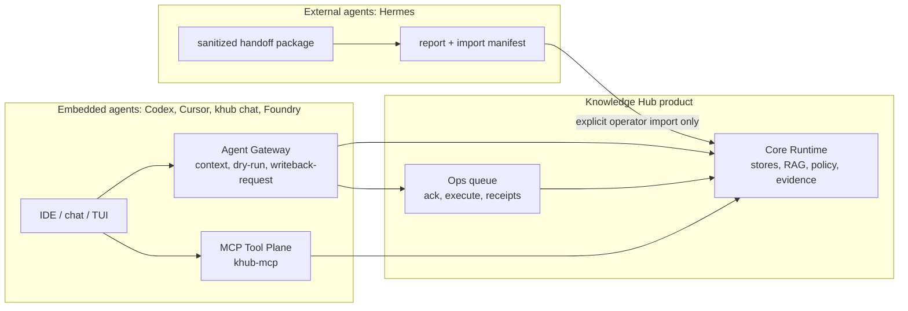

# ADR: Four-Layer Agent Architecture

Date: 2026-06-03

## Status

Accepted as the design contract for agent-facing work.

## Context

`knowledge-hub` already has several agent-adjacent surfaces:

- Core runtime commands such as `discover`, `index`, `search`, `ask`, `inspect`, `papers`, and `doctor`.
- MCP through `khub-mcp` and `knowledge_hub.interfaces.mcp.server`.
- `Agent Gateway v1/v2` through `khub agent context`, `khub agent run --dry-run`, `khub agent writeback-request`, and `khub labs ops`.
- `foundry-core`, which provides the strongest delegated `PLAN -> ACT -> VERIFY -> WRITEBACK` runtime semantics.
- Experimental interface work in a dirty LLM CLI worktree for `chat`, `tui`, `auth`, `models`, and `enrich`.
- External handoff examples such as the Hermes public source radar bundle under the KnowledgeOS workspace artifacts directory.

If these surfaces are treated as peers, the product boundary becomes unclear.
The same goal could be interpreted as a runtime feature, an MCP tool, a gateway
contract, an interface command, or an external agent workflow. That would make
policy, evidence authority, and mutation rules hard to audit.

## Decision

Knowledge Hub agent work is split into four layers.

### 1. Core Runtime

Owner: `knowledge_hub/`.

Role:

- local stores, DB, indexes, paper and web ingest, retrieval, RAG, answerability, source authority, policy, and evidence reports
- default product promise: `discover -> index -> search/ask -> evidence review`
- final authority for classification, outbound provider gating, source-backed evidence, and answer payload semantics

Rules:

- Interfaces, chat, Foundry, and external agents must not bypass Core Runtime for retrieval, policy, or evidence authority.
- New answer paths must reuse existing runtime services or explicitly document why they are labs-only.
- Parser, DB, index, vault, source-span, StrictEvidence, and answer-visible evidence mutations require their existing gates.

### 2. MCP Tool Plane

Owner: `khub-mcp`, `knowledge_hub.interfaces.mcp.server`, and `knowledge_hub.mcp.tool_specs`.

Role:

- canonical tool catalog for agents and IDEs
- default profile for retrieval, answer, context, and paper lookup/read helpers
- labs/all profiles for agentic, ingest-heavy, operator, learning, and job surfaces

Rules:

- MCP is the canonical agent tool plane.
- CLI, chat, TUI, Foundry, and IDE integrations should be thin clients over existing services/tools, not duplicate RAG or paper lookup logic.
- New MCP gateway tool families are prohibited unless a later ADR changes this boundary.

### 3. Agent Gateway

Owner: `khub agent ...`, `knowledge_hub.application.agent_gateway`, `knowledge_hub.application.agent_writeback_preview`, and existing ops action queue surfaces.

Role:

- JSON contract window for agent context, dry-run envelopes, and approval-gated writeback requests
- official surfaces:
  - `khub agent context "goal" --repo-path . --json`
  - `khub agent run --goal "goal" --repo-path . --dry-run --json`
  - `khub agent writeback-request "goal" --repo-path . --json`
  - `khub labs ops action-ack|action-execute|action-resolve`

Rules:

- No new top-level `khub gateway` command family.
- Gateway v1 remains read-only/dry-run.
- Gateway v2 remains a narrow approval-gated repo-local writeback lane, not a general autonomous agent platform.
- Writeback remains blocked until operator acknowledgment and execution through the existing ops queue.

### 4. Interface

Owner: CLI shells, future `chat`/`tui`, IDE integration, KnowledgeOS skills/hooks, and external operator workflows.

Role:

- user-facing assistant and operator surfaces
- intent routing, display, session UX, model selection UX, and handoff packaging

Rules:

- Interfaces are orchestration and presentation layers.
- Ordinary assistant turns are read path by default.
- Interface commands may request writeback through Gateway or import a reviewed external handoff manifest, but they must not hide mutations inside chat or TUI turns.
- KnowledgeOS skills and hooks coordinate work; they do not become product-code authority.

## Embedded vs External Agents

Embedded agents run close to the product repo and can use Gateway and MCP.
They still inherit Core Runtime authority and must request writes through the
approval lane.

External agents receive sanitized handoff packages under `artifacts/<agent>/<date>/`.
They are report-only by default and must not run `khub`, scan the vault, or
mutate local stores unless an operator explicitly imports a manifest.

## Foundry vs Gateway vs Core

- Core Runtime owns facts, policy, evidence, and answer behavior.
- Gateway owns contract envelopes and writeback request semantics.
- Foundry owns delegated runtime orchestration when used, especially
  `PLAN -> ACT -> VERIFY -> WRITEBACK` traces.
- Foundry does not own retrieval/evidence policy, and Gateway does not become a
  replacement runtime.

## Prohibited Shapes

- New `khub gateway` top-level family.
- Chat/TUI commands that duplicate RAG or paper lookup instead of calling existing services.
- External handoffs that contain private raw vault data by default.
- Hidden background mutations from assistant turns.
- Treating derivative memory, claim, ontology, or cluster rows as citation evidence without a later gate.

## Consequences

- Future `chat` and `tui` work should be merged as Interface work, not as a new product center.
- MCP remains the tool list agents should depend on.
- Gateway remains a narrow JSON contract and approval lane.
- External agents such as Hermes stay outside the mutation boundary until an explicit import manifest is reviewed.

## References

- `docs/guides/agent-gateway-v1.md`
- `docs/guides/cli-commands.md`
- `docs/foundry-knowledge-hub-integration.md`
- `docs/adr/2026-06-03-external-agent-handoff-v1.md`
- `docs/guides/agent-architecture.md`

