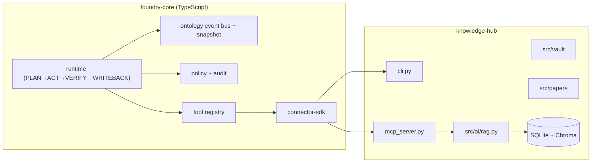

# knowledge-hub + Personal Foundry v1 결합 설계 (AI Hub 연동 제외)

작성일: 2026-02-18  
범위: `/Users/won/Desktop/allinone/knowledge-hub`만 사용

## 1. 결합 목표

`knowledge-hub`의 로컬 지식 인프라(노트/논문/웹 + 검색 + MCP/CLI)를 유지한 채, 개인용 Foundry형 에이전트 런타임을 붙인다.  
핵심은 `P0` 원문은 로컬에만 두고, 외부 처리나 플러그인은 `P1/P2` 수준 정제 데이터만 넘기는 방식이다.

## 2. 추천 아키텍처 (권장)



## 3. 결합 방식 (knowledge-hub 전용)

### 3.1 경계
- MCP는 런타임 입구로만 사용한다.
- `cli.py`는 운영 도구 보조로 두되, 에이전트가 직접 조합할 수도 있다.
- Node.js 런타임은 상태와 정책/감사를 책임지고, knowledge-hub는 실제 데이터/검색 책임을 가진다.

### 3.2 최소 도구 세트 (MCP 확장)
- `ask_knowledge(question, top_k, min_score, source)`
- `search_knowledge(query, top_k, source)`
- `note_show(note_id)` / `note_list` / `note_search`
- `paper_list` / `paper_search` / `paper_translate`
- `graph_stats` / `graph_show`
- 추가: `run_agentic_query(goal)` (오케스트레이터 전용)

### 3.3 런타임 루프
1. `PLAN`: 질문을 subgoal로 분해 (`search`, `summarize`, `compare` 등)
2. `ACT`: 도구 호출하고 결과를 받아온다
3. `VERIFY`: 스키마 검사, 근거 존재성, 정책 검사(`P0` 차단)
4. `WRITEBACK`: 결과 + 근거 + runId + 감사로그를 기록하고 사용자 응답

### 3.4 터미널 인터페이스 제안 (UI 없음)
- `khub agent run "<goal>"` 기본 명령(Plan/Act/Verify/Writeback 로그 출력)
- `--max-round`, `--tool`로 실행 제어
- `--dry-run`으로 정책·스키마 실패만 점검
- `--dump-json`으로 `runId`, `stage`, `tool trace`, `audit`를 JSON으로 출력

## 4. 온톨로지 + 이벤트 우선 모델

### 엔티티
- `KnowledgeItem`, `Paper`, `Person`, `Task`, `Schedule`, `Transaction`, `SleepLog`, `BehaviorEvent`

### 관계
- `MENTIONS`, `DERIVES_FROM`, `CITED_BY`, `PART_OF`, `AFFECTS`, `SUPPORTS`

### 이벤트
- `DocumentIngested`, `DocumentIndexed`, `AgentPlanned`, `ToolCalled`, `ToolResult`, `VerifyFailed`, `PolicyDenied`, `WritebackDone`

### 데이터 계층
- SQLite: 정적 메타/온톨로지/이벤트 아카이브/런 로그
- Chroma: 문서 임베딩(기존 유지)
- 이벤트 스냅샷: 매일/매회차로 상태 복원 비용 최적화

## 5. 보안/개인정보 설계

- 분류 체계
  - `P0`: 원문/비식별 불가능 원시 데이터
  - `P1`: 구조화 facts
  - `P2`: summary
  - `P3`: 공개 정보
- 정책 규칙
  - 기본값은 deny-by-default + allow-list
  - 외부/LLM 호출 전 `sanitizeForExternal` 강제
  - 토큰/비밀번호/계좌 등 패턴은 마스킹 + hash
  - `agent_artifact_write` 단계에서 `P0` 분류는 block 처리 후 결과를 `blocked`로 마스킹 반영
- 감사
  - 도구 호출, 정책 결정, 스키마 실패, dedupe/리트라이 상태를 이벤트로 저장

## 6. 어떤 형태의 기능이 가장 좋을까?

### Phase 1: 가장 빨리 쓰는 기능 (1주)
- `agent-run` 명령: `khub ask`에 플래너 + 근거+검증
- run trace 뷰: PLAN/ACT/VERIFY/WRITEBACK 로그
- 정책 위반 즉시 중단 + 사유 표시

### Phase 2: 실용형 기능 (2~3주)
- 정적+동적 이벤트 결합 질의
  - 예: `이번 주 sleep<6시간 날의 집중 문서 수 증가율`
- 자동 결함 탐지
  - 고립 노트, 반복된 핵심 질문, 최신성 낮은 근거 경고

### Phase 3: 플랫폼화 (4주+)
- 커넥터 SDK를 통한 일정/지출/헬스 앱 연동
- 요약 브리프 자동 발행:
  - `daily coach`, `weekly review`, `focus backlog`

## 7. 대안 2개 비교

### 대안 A (권장): MCP 브리지 + TypeScript 런타임
- 장점: 기존 코드 변경 최소, 로컬 아키텍처 유지, 확장성이 높음
- 리스크: 브리지 스키마/에러 표준화가 필수

### 대안 B: Python 내부 단일 런타임
- 장점: 디버깅 경로 단순
- 리스크: TS 생태계 도구(타입/런타임 정책/웹 앱)와 다시 결합 시 변환 비용 증가

권장: **대안 A**

## 8. Assumption / 불확실점
- 초기에는 동적 데이터는 외부 CSV/파일 Import + 수동 기록으로 시작한다.
- 다중 에이전트 간 직접 메시징은 생략하고, `tool parallel`와 `critic verify`로 대체한다.
- 로컬 우선 정책을 위해 외부 LLM 기본은 비활성, 필요 시 요약/구조화 전송만 사용한다.

## 9. CLI 결합 실행 가이드 (현재 구현 대상)

- 에이전트 질의 실행
  - `python cli.py agent run "이번 주에 중요 논문 3개 요약해줘"`
  - `python cli.py agent run "논문과 노트에서 강화학습 관련 비교 포인트 정리" --role researcher --orchestrator-mode adaptive --max-rounds 3`
  - `python cli.py agent run "재무 지출 이상치 이상 탐지" --dry-run --compact`
  - `python cli.py agent run "핵심 논문 5개 정리" --max-rounds 2 --orchestrator-mode strict --report-path /tmp/agent-run.json --dry-run --dump-json`

- MCP에서 에이전트 질의 호출
  - `run_agentic_query` 도구 호출 시 `goal`, `max_rounds`, `dry_run`, `dump_json`, `compact` 파라미터 사용
  - 텍스트 모드 축약은 `compact: true`
  - 예시
    - `run_agentic_query({"goal":"강화학습 정리", "max_rounds":3, "role":"analyst", "orchestratorMode":"adaptive", "compact":true})`
    - `run_agentic_query({"goal":"논문 요약", "max_rounds":2, "reportPath":"./artifacts/agent-run.json", "dump_json":true})`
- 공통 옵션
  - `reportPath`: 실행 후 리포트 저장(스키마 `knowledge-hub.foundry.agent.run.report.v1`)
  - `KHUB_FOUNDRY_RETRY_ATTEMPTS`: MCP → foundry 브리지 재시도 횟수(기본 2회)
- Connector 스냅샷 동기화(로컬 온디바이스 입력)
  - `python cli.py agent sync --json --source all --limit 200`
  - 증분 동기화: `python cli.py agent sync --json --cursor "<ts>" --limit 200`
  - 결과는 `{"ts","items":[...], ...}` 형태의 JSON 문자열이며, 추후 `foundry-core` 런타임 스냅샷 소스로 사용할 수 있다.

### 10. 표준 출력 스키마 (현재 적용)

- `foundry-core/cli-agent.ts` + `run_agentic_query`는 동일 형태 엔벨로프를 기준으로 동작합니다.
- 성공/실패 모두 다음 키를 우선 노출합니다.
  - `schema`: `knowledge-hub.foundry.agent.run.result.v1`
  - `source`: 실행 소스(예: `foundry-core/cli-agent`, `knowledge-hub/cli.py.fallback`)
  - `artifact json schema`: `foundry-core/docs/schemas/agent-run-result.schema.json`
  - `runId`: 런타임 실행 ID
  - `status`: `completed/blocked/failed/running`
- 권장 트레이스 코드(운영 정합성 강화용):
  - `transitions[].code` 형식: `PLAN.PLAN`, `PLAN.SKIP`, `ACT.TOOL`, `VERIFY.PASS`, `VERIFY.BLOCK`, `VERIFY.FAIL`, `WRITEBACK.DONE`
  - 브리지/런타임 모두에서 가능한한 동일 규칙으로 정규화.
- `goal`, `stage`, `plan`, `trace`
  - `verify`: 정책/스키마 검증 결과
    - `allowed`, `schemaValid`, `policyAllowed`, `schemaErrors`
  - `artifact`: 생성 결과
  - `createdAt`, `updatedAt`, `dryRun`

예시(MCP/CLI `--dump-json`):
```json
{
  "schema": "knowledge-hub.foundry.agent.run.result.v1",
  "source": "foundry-core/cli-agent",
  "runId": "run_xxx",
  "status": "completed",
  "goal": "...",
  "stage": "DONE",
  "plan": ["search_knowledge", "ask_knowledge"],
  "transitions": [],
  "verify": {"allowed": true, "schemaValid": true, "policyAllowed": true, "schemaErrors": []},
  "artifact": {"id": "...", "jsonContent": {...}},
  "createdAt": "2026-..",
  "updatedAt": "2026-..",
  "dryRun": false
}
```

### 11. `agent discover` (CLI-only 패턴)

- 기본 실행
  - `python cli.py agent discover --source all --days 7`
  - `python cli.py agent discover --feature daily_coach --feature focus_analytics --days 7 --source all --json`

- 파일 기반 재실행/재시도
  - `python cli.py agent discover --source all --days 7 --output .tmp-discover.json`
  - `python cli.py agent discover --resume .tmp-discover.json`
  - `python cli.py agent discover --resume .tmp-discover.json --to 2026-02-18T23:59:59` (명시 옵션 우선)

- 병합 규칙
  - `--resume` 사용 시 기본은 이전 파일의 `request`를 기본값으로 사용하고, 현재 커맨드에서 명시한 옵션만 우선 적용합니다.
  - `--feature`를 명시하면 `--resume`의 실패-feature 필터를 무시하고, 명시한 feature만 실행합니다.
  - `--fail-on-error`(기본값)로 에러(`status=error`)를 실패 종료로 처리합니다.
  - `--fail-on-partial`를 사용하면 부분 실패(`status=partial`)를 파이프라인 실패로 처리합니다.

- 출력 스키마(`knowledge-hub.agent.discover.result.v1`)
  - `runId`: 실행 ID
  - `status`: `ok | partial | error`
  - `sync`: `foundry sync` 결과(실패 시 `ok:false`)
  - `errors`: 실패/경고 메시지 배열(있을 때만 사용)
  - `features`: 각 feature별 `{feature, ok, result, error}`
  - `request`: 실제 실행 요청 스냅샷
  - JSON Schema 파일: `foundry-core/docs/schemas/agent-discover-result.schema.json`

- 검증(선택)
  - `python cli.py agent discover-validate --input .tmp-discover.json`
  - `python cli.py agent discover-validate --input .tmp-discover.json --json`

- 실행 정책 예시
  - `python cli.py agent discover --source all --days 7 --fail-on-partial`
  - `python cli.py agent discover --source all --days 7 --fail-on-partial --no-fail-on-partial --no-fail-on-error`

  - 스키마 정리

    ```json
    {
      "schema": "knowledge-hub.agent.discover.result.v1",
      "runId": "khub-discover-...",
      "source": "knowledge-hub/cli.py.agent.discover",
      "status": "ok",
      "errors": [],
      "sync": {},
      "features": [
        {"feature": "daily_coach", "ok": true, "result": {}, "error": null}
      ],
      "request": {
        "source": "all",
        "days": 7,
        "from": "2026-02-01T00:00:00",
        "to": "2026-02-18T23:59:59",
        "topK": 8,
        "limit": null,
        "intent": "analyze",
        "features": ["daily_coach", "focus_analytics", "risk_alert"],
        "expenseThreshold": null,
        "minSleepHours": null,
        "eventLogPath": ".foundry-ontology-events.jsonl",
        "stateFile": ".foundry-sync-state.json",
        "saveState": true,
        "resumeSource": false,
        "resolution": {
          "source": "cli",
          "days": "cli",
          "from": "resume",
          "to": "cli",
          "topK": "cli",
          "limit": "resume",
          "intent": "cli",
          "features": "cli",
          "expenseThreshold": "cli",
          "minSleepHours": "cli",
          "eventLogPath": "cli",
          "stateFile": "cli",
          "saveState": "cli"
        }
      }
    }
    ```
