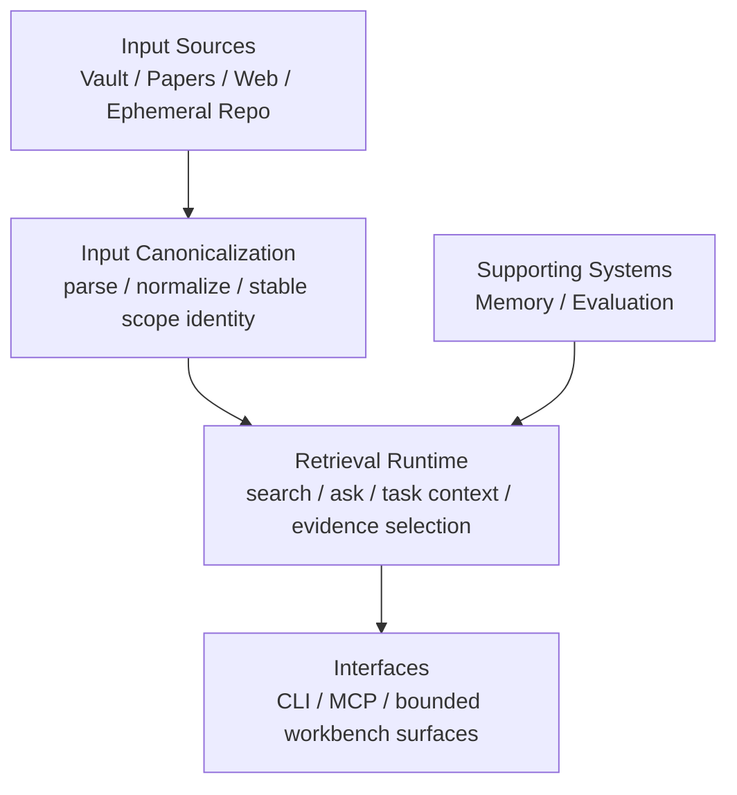

# Retrieval-Centered Architecture Draft

Date: 2026-03-19
Status: Draft

Purpose:
- Reframe `knowledge-hub` around the product reality already visible in the repo.
- Keep `Retrieval Runtime` as the architectural center.
- Treat memory and evaluation as supporting capabilities, not peer platforms.
- Clarify what should stay core, what should remain supporting, and what should stay in labs.

This is a documentation draft, not a committed runtime or package-reorganization decision.

## 1. Objective

The project has grown beyond a narrow RAG utility, but its clearest product identity is still a retrieval-centered knowledge runtime.

What already looks durable:
- note, paper, and web ingestion
- local-first retrieval and grounded answer generation
- inspectable retrieval diagnostics and answer verification
- additive memory experiments such as `document_memory` and `paper_memory`
- thin CLI and MCP entry points over shared runtime behavior

What should not define the architecture story by itself:
- broad agent-platform expansion
- ontology governance as a primary product identity
- large labs surfaces competing with the retrieval story
- promoting every useful subsystem into a top-level layer

The target framing is:

`knowledge-hub = retrieval-centered knowledge runtime with supporting memory and evaluation capabilities`

## 2. Constraints

Confirmed constraints from the current repo:
- local-first remains non-negotiable
- Python remains the product/runtime/data surface
- `foundry-core` remains the stricter runtime/policy bridge, not the data owner
- existing CLI/MCP contracts should be preserved when possible
- changes should be additive and reversible
- this draft does not imply runtime rewrites or package moves

## 3. Current Reality

The repo already has the important pieces. The issue is not missing layers. The issue is that documentation can over-promote supporting systems until they read like separate products.

Confirmed current reality:
- retrieval is the default product surface in README and current CLI/MCP behavior
- `document_memory` exists, but remains a labs or promotion-candidate surface
- `paper_memory` exists as an additive retrieval aid, not as the core runtime
- paper judge exists as an optional discovery-stage filter, not as a retrieval core subsystem
- answer verification exists as a retrieval quality gate, not as a standalone platform

So the right move is not to add more layers. It is to describe the existing runtime with the correct center of gravity.

## 4. Minimum Layer View

The minimum stable architecture view should be:

1. `Input Canonicalization`
2. `Retrieval Runtime`
3. `Supporting Systems`
4. `Interfaces`

This is enough to explain the current system without inventing extra orchestration layers.

## 5. Layer Map

## 6. Layer Roles

### A. Input Canonicalization

Purpose:
- normalize and scope source documents before retrieval

Current likely owners:
- `knowledge_hub/core/chunking.py`
- `knowledge_hub/vault/parser.py`
- `knowledge_hub/papers/manager.py`
- `knowledge_hub/web/ingest.py`

Role:
- vault heading-aware parsing
- paper and web source normalization
- stable scope identity
- source metadata cleanup

### B. Retrieval Runtime

Purpose:
- remain the product core
- answer queries using grounded evidence from the local-first knowledge base

Current likely owners:
- `knowledge_hub/ai/rag.py`
- `knowledge_hub/ai/retrieval_fit.py`
- `knowledge_hub/application/context_pack.py`
- `knowledge_hub/application/task_context.py`
- `knowledge_hub/application/runtime_diagnostics.py`

Role:
- `search`
- `ask`
- `agent context`
- paper-scoped narrowing
- evidence budgeting
- citation assembly
- retrieval diagnostics

### C. Supporting Systems

Purpose:
- strengthen retrieval without becoming separate platform stories

This group currently contains two supporting capability families.

#### Memory

Current likely owners:
- `knowledge_hub/document_memory/models.py`
- `knowledge_hub/document_memory/builder.py`
- `knowledge_hub/core/document_memory_store.py`
- `knowledge_hub/papers/memory_builder.py`

Current role:
- `document_memory` as a labs or promotion-candidate retrieval aid
- `paper_memory` as an additive retrieval aid
- human-readable summary-first representations that may later prove useful for prefiltering or retrieval support

Current non-goal:
- do not describe memory as a core-equal platform
- do not assume memory becomes the default runtime path before promotion criteria are met

#### Evaluation

Current likely owners:
- `knowledge_hub/ai/answer_verification.py`
- `knowledge_hub/ai/paper_answer_quality.py`
- `knowledge_hub/papers/judge.py`
- `scripts/eval_document_memory.py`
- `docs/research/document-memory-eval.md`

Current role:
- answer verification as a retrieval quality gate
- paper judge as an input-layer optional filter during discovery
- memory eval and retrieval diagnostics as promotion and calibration support
- quality diagnostics and failure logging

Current non-goal:
- do not describe evaluation as a standalone execution plane
- do not imply a new evaluation platform unless runtime pressure actually requires it

### D. Interfaces

Purpose:
- expose the core runtime through thin, inspectable entry points

Current likely owners:
- `knowledge_hub/interfaces/cli/main.py`
- `knowledge_hub/interfaces/cli/commands/`
- `knowledge_hub/mcp/handlers/`

Default interface emphasis:
- `search`
- `ask`
- `discover`
- `paper`
- `index`
- `status`
- `agent context`

CLI and MCP should stay thin surfaces over shared runtime behavior, not alternate architecture centers.

## 7. Main vs Supporting vs Labs

### Main

These define the product story today:
- `Input Canonicalization`
- `Retrieval Runtime`
- `Interfaces`

### Supporting

These improve the core story without becoming peer platforms:
- `Memory`
- `Evaluation`
- notebook bridge or bounded workbench adapters when they serve retrieval-first flows
- graph or ontology signals when they act as bounded retrieval signals

### Labs

These remain valuable, but should stay behind an explicit experimental boundary until they prove stable product value:
- `document_memory` as long as it remains under explicit eval
- `ask-graph`
- `transform`
- `learning`
- `ops`
- broader ontology governance workflows

## 8. Guardrails Against Over-Layering

This draft is acceptable only if it stays close to existing runtime reality.

Avoid language like:
- `memory orchestration layer`
- `evaluation orchestration layer`
- `retrieval policy layer`
- `semantic mediation layer`
- `graph augmentation layer`

Use this rule instead:
- add a named architectural capability only when it already has stable implementation weight in the repo and clearly improves the explanation of core retrieval behavior

Memory and evaluation should be described as supporting capabilities that help explain the retrieval runtime, not as independent large platforms.

## 9. Naming Guidance

The near-term change is naming and framing in docs, not package movement.

Near-term guidance:
- say `retrieval runtime` for the core
- say `supporting memory capability` or `memory promotion candidate`, not `memory layer` in the heavyweight sense
- say `quality gate`, `verification`, or `evaluation support`, not `evaluation plane`
- say `interfaces` only for CLI and MCP entry points

Not implied by this draft:
- no immediate package split
- no physical reorganization into `input/`, `memory/`, `retrieval/`, or `evaluation/`
- no new runtime contracts

If runtime pressure later justifies physical package changes, that should be a separate decision backed by code-level evidence.

## 10. What To Promote Next

If this framing is accepted, the next decisions should remain narrow:

1. Keep `document_memory` in labs or supporting-candidate status until eval proves stable retrieval value.
2. Keep paper judge framed as an optional input filter rather than letting it expand into a broader product subsystem.
3. Keep answer verification framed as a retrieval quality gate and inspectability mechanism.
4. Only revisit stronger subsystem boundaries if retrieval complexity actually forces them.

## 11. Promotion Criteria For `document_memory`

Promote from labs only if:
- it consistently beats or complements chunk-first retrieval on real queries
- operators can explain why results were selected
- broad-topic and named-document query handling are both stable
- stitched segments are more readable than raw chunk hits
- evaluation loops remain cheap enough to maintain

Even then, promotion should first mean "supporting retrieval capability," not "new co-equal runtime center."

## 12. Final Draft Position

The current best architectural reading of `knowledge-hub` is:

`Retrieval Runtime` is the core. `Memory` and `Evaluation` are supporting capabilities. `Interfaces` are thin entry points over shared behavior.

In short:

`knowledge-hub` should be described as a local-first retrieval-centered knowledge runtime whose supporting advantage comes from bounded memory formation experiments and inspectable evaluation gates.`
