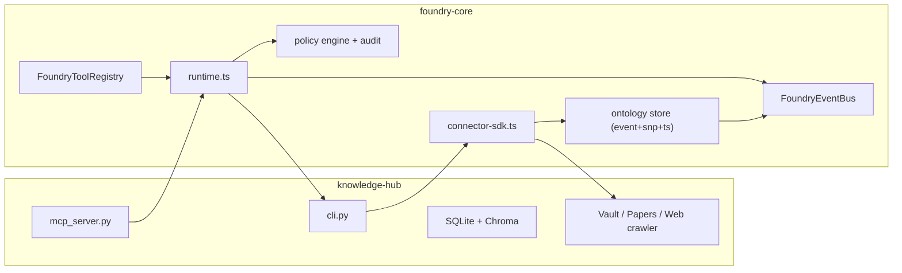

# Personal Foundry v1.0 (Knowledge-Hub 전용, CLI 우선) 통합 설계

작성일: 2026-02-18  
범위: `/Users/won/Desktop/allinone/knowledge-hub` 만 사용  
목표: **`ai-hub` 비결합**, 순수 CLI 기반으로 지식/개인 데이터가 연결되는 Foundry 스타일 실행 환경 구현

## 1. 핵심 목표

- local-first: 정적 데이터(노트/논문/웹)와 동적 데이터(일정/지출/수면/행동 로그)가 동일 온톨로지 상에 들어와야 한다.
- 개인 데이터를 온톨로지화: `entity / relation / event`로 모델링하고 `event sourcing + snapshot + time series` 구성.
- CLI-only 운영: UI 없이 터미널에서 agent run/sync 상태를 조회하고 제어.
- 외부 API는 P0 원문 전송 금지. 외부 전송은 `facts` 또는 `summary`만 가능.
- connector + feature + agent runtime + policy/audit가 한 흐름으로 동작.

## 2. 아키텍처 (권장안 A)

## 3. 데이터 흐름

### 3.1 Sync (knowledge-hub ↔ foundry)

1. CLI: `python cli.py agent sync --source ... --limit ... --cursor ...`
2. `foundry-core/src/cli-agent.ts`의 sync 모드가 해당 소스에 대해 `runConnectorSync` 실행.
3. knowledge-hub connector가 `cli.py agent sync` 출력(payload)을 받아 `rawRecords` 생성.
4. `mapToOntology`에서 `KnowledgeItem` 엔티티/`DocumentIngested` 이벤트로 변환.
5. `emitOntologyBatchToBus`로 버스에 발행 + 감사 로그 + 커서 저장.

### 3.2 Query/Action (agent run)

1. CLI: `python cli.py agent run "<goal>" --max-rounds N --dump-json`
2. `foundry-core/src/runtime.ts`의 Plan→Act→Verify→Writeback 파이프라인 실행.
3. tool은 knowledge-hub의 `ask_knowledge`, `search_knowledge` 사용.
4. policy → schema 검증 → writeback. 결과는 통일된 envelope로 출력.

## 4. 온톨로지 스키마(요약)

- Entity
  - `KnowledgeItem`, `Person`, `Task`, `Schedule`, `Expense`, `SleepLog`, `BehaviorEvent`
- Relation
  - `MENTIONS`, `REFERENCES`, `CITED_BY`, `DERIVES_FROM`, `PART_OF`, `AFFECTS`
- Event
  - `DocumentIngested`, `DocumentIndexed`, `AgentPlanned`, `ToolCalled`, `ToolResult`, `VerifyFailed`, `PolicyDenied`, `WritebackDone`
- 분류
  - P0 raw(원문), P1 structured facts(이벤트/요약 구조), P2 summary, P3 public
- 저장
  - Event Log: `sourceId + cursor + occurredAt`
  - Snapshot: 엔티티 스트림별 최신 상태
  - TimeSeries: `SleepHours`, `ScreenTime`, `SpendingAmount`, `TaskCompletionRate`

## 5. 보안/개인정보(제약)

- 원칙: **P0 raw는 로컬 저장만 허용**, 외부 tool 호출 전 `sanitizeForExternal`.
- 정책 엔진의 기본 동작은 deny-by-default.
- 감사 항목 최소 로그:
  - `connector.sync.started/completed/failed`
  - `agent_artifact_write`
  - `agent_tool`
  - `policy denied/warn`

## 6. CLI 계약(운영 기준)

- Sync
  - `python cli.py agent sync --source all|note|paper|web|expense|sleep|schedule|behavior --limit 200`
  - `python cli.py agent sync --source all --limit 200 --cursor <ts> --json`
  - `python cli.py agent sync --source all --foundry --event-log .foundry-ontology-events.jsonl --json`
  - 동적 소스 JSONL 파일(`data/dynamic/<source>.jsonl`)도 동일 `--source`로 동기화.
  - 내부 `foundry-core/src/cli-agent.ts`는
    - `--state-file`
    - `--fresh`
    - `--all-sources`
    - `--fail-fast`
    - `--no-save-state`
    - `--event-log <path>`
    를 지원.
- Feature
  - `python cli.py agent feature list`
  - `python cli.py agent feature daily_coach --days 7 --source all --json`
  - `python cli.py agent feature risk_alert --expense-threshold 200000 --min-sleep-hours 6 --from 2026-02-01T00:00:00 --to 2026-02-18T23:59:59`
- Discover
  - `python cli.py agent discover --feature all --days 7 --source all`
  - `python cli.py agent discover --feature daily_coach --feature focus_analytics --state-file .foundry-sync-state.json --event-log .foundry-ontology-events.jsonl`
  - `python cli.py agent discover --output .tmp-discover.json --source all --days 7`
  - `python cli.py agent discover --resume .tmp-discover.json --feature daily_coach`
  - `python cli.py agent discover --source all --days 7 --fail-on-partial`
  - `python cli.py agent discover --source all --days 7 --fail-on-error --no-fail-on-partial`
  - `python cli.py agent discover-validate --input .tmp-discover.json`
  - `agent discover` 결과 스키마: `foundry-core/docs/schemas/agent-discover-result.schema.json`
  - 결과 스키마: `knowledge-hub.agent.discover.result.v1`(sync summary + feature array)
  - `--resume` 시점 규칙: 기본적으로 이전 결과의 `request`를 사용하되, 현재 명령의 `--from/--to/.../--feature` 등 명시 옵션이 우선합니다.
- Agent run
  - `python cli.py agent run "<goal>" [--max-rounds N] [--dry-run] [--dump-json] [--compact]`
  - foundry-core fallback이 없을 경우 기존 python 폴백 동작 사용.
  - feature 이벤트 로그: `.foundry-ontology-events.jsonl`

## 7. TypeScript 인터페이스 확장 포인트

- 새 파일: `foundry-core/src/contracts/foundry-platform.ts`
  - 아래 항목을 `connector / runtime / ontology / feature / policy / cli envelope` 단에서 스키마로 정리
  - `FoundryRuntimeContract`
  - `LocalFirstPolicyEngine`
  - `OntologyStoreAdapter`, `OntologyBus`
  - `FeatureFunction`, `FeatureRegistry`
  - `SyncCommandInput / SyncCommandResult`
  - `AgentCommandEnvelope`

## 8. 구현 우선순위 (현재 상태 기준)

1. **현재 완료(기반)**
   - knowledge-hub → foundry connector 연결
   - CLI sync/run 브리징
   - 상태파일 기반 커서 저장/복원
   - 다중 소스 동기화 및 fail-fast
   - 동적 소스(비정형/개인지표) JSONL 소스 동기화 지원
   - feature layer 런타임 등록 (`daily_coach`, `focus_analytics`, `risk_alert`) 및 `agent feature` 실행
   - sync 이벤트를 `.foundry-ontology-events.jsonl`로 영속화해 feature layer 입력으로 사용
2. **다음 단계**
   - 동적 데이터 소스 1차 연결: 일정/지출/수면/행동 로그 CSV/DB import connector
   - feature layer에 정적+동적 융합 질의 추가 (`daily_coach`, `focus_analytics`, `risk_alert`)
   - 정책 규칙 JSON 파일화 + hot-reload
3. **확장 단계**
   - 전용 local policy + audit 저장소 영구화(현재는 console/file fallback)
   - 이벤트 스냅샷 적재 스케줄러
   - MCP 도구 확장(그래프 기반 질의, 정책 기반 도구 권한)

## 9. 모호점과 가정

### 가정(현재 시스템에서 결정 필요)
  - 동적 데이터는 `data/dynamic/*.jsonl` 기반 동기화로 시작.
- external LLM을 사용해도 `facts/summary`만 전송하고 원문(`P0`)는 전송하지 않음.
- 이벤트 스토어는 초기엔 SQLite 기반, 확장 시 별도 append-only 파일/DB로 분리 가능.
- `goal` 단위 정책 판단은 actor/project 단위가 아닌 현재 단일 사용자 기준.

### 대안 2개 비교

#### 대안 A (권장): `foundry-core`를 제어면로 쓰고, knowledge-hub는 커넥터/도구 공급자
- 장점
  - CLI-우선 요구 충족이 빠름
  - 기존 knowledge-hub 기능을 건드리지 않고 병합 가능
  - 커넥터 단위로 확장 쉬움
- 리스크
  - Python-Node 간 프로세스 호출 비용
  - 타입 동기화 필요 (schema 버전 관리)

#### 대안 B: Python에 agent runtime을 몰아서 통합하고 TypeScript는 최소화
- 장점
  - 런타임 스택 단일화로 배포/운영 단순
  - `cli.py` 하나로 모든 경로 제어 가능
- 리스크
  - 기존 TS connector runtime 설계가 가진 타입/도구 체계 재작성 부담
  - 향후 Electron/Tauri 앱 전환 시 재작업 비용 상승

## 10. 결정

`대안 A`를 우선 적용한다.  
이유: 현재 요구사항(터미널 중심 연결 + knowledge-hub 유지 + 빠른 결합)에 가장 적합하며, 점진적으로 동적 데이터 커넥터를 추가해도 구조가 안정적이다.

## 11. 최소 실행 체크리스트

1. `node cli-agent.ts ... sync --all-sources --persist ...`로 동기화
2. `python cli.py agent run "..." --dump-json`으로 단일 query 실행
3. `python cli.py agent feature daily_coach --source all --days 7`로 통합 지표 실행
4. `python cli.py agent discover --feature all --source all --days 7`로 1회성 진단 수행
5. policy deny가 발생하면 deny 이유와 runId를 바로 로그에서 조회
